# MD/CyberStick to USB Converter (MD2mini2USB) Nintendo Switch/MegaDrivemini2 Cyberstickモード対応版  

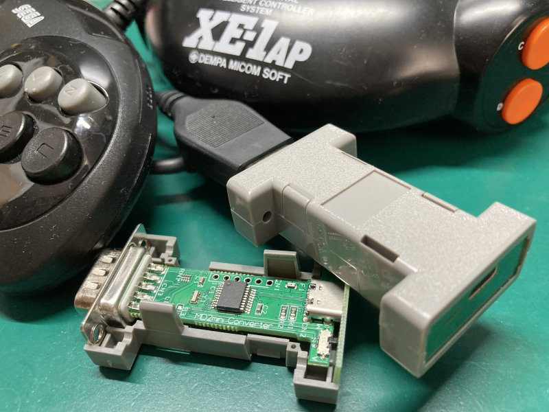  

**「メガドライブ2ミニ対応」 ←→ 「Ninetndo Switch対応」 の切り替えはファームウェア書換が必要です。**  

MD2mini2USBは、ジョイスティックコンバータです。  
メガドライブ対応コントローラ(3ボタン/6ボタン)・SHARP CyberStick(CZ-8NJ2),マイコンソフト XE-1AJ  
のプロトコルを変換し、DirectInput方式のUSBコントローラとして使える様にするコンバータです。  
元々は、メガドライブ2ミニ向けに制作していましたが、Nitendo Switchでも使用できる様になりました。  

現在、接続するゲーム機にあわせて2種類のファームウェアがあります。  
### メガドライブ2ミニ向けファームウェア  
下記コントローラ互換として動作します。  

* SEGA ファイティングパッド6B  
* マイコンソフト　サイバースティック XE1AJ1-USB  

**※ XE1AJ1-USBモードはMegaDrive2mini/Genesis2mini/PC接続のみ対応しています**

### Nintendo Switch向けファームウェア
下記コントローラ互換品として動作します。 

* HORI NSW-063(『ポッ拳 DX』専用コントローラー)  

## ■ 使用例
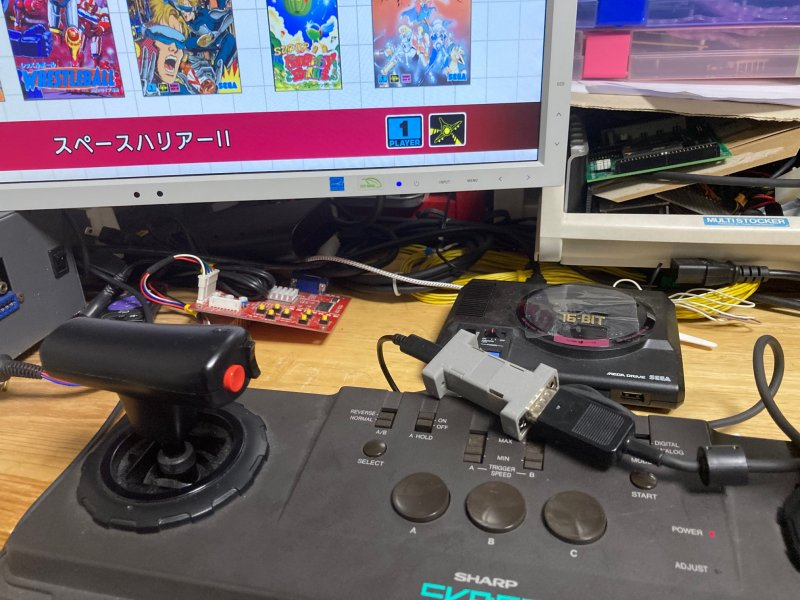 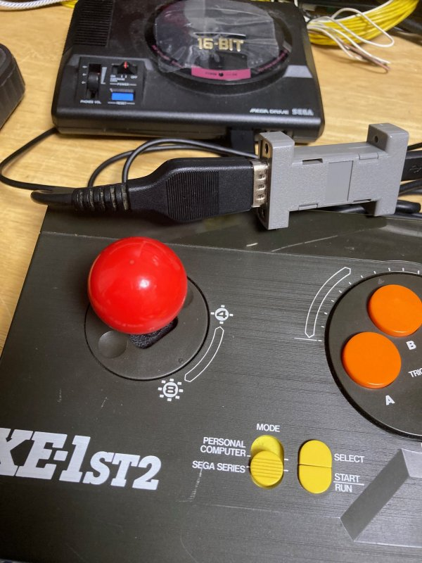 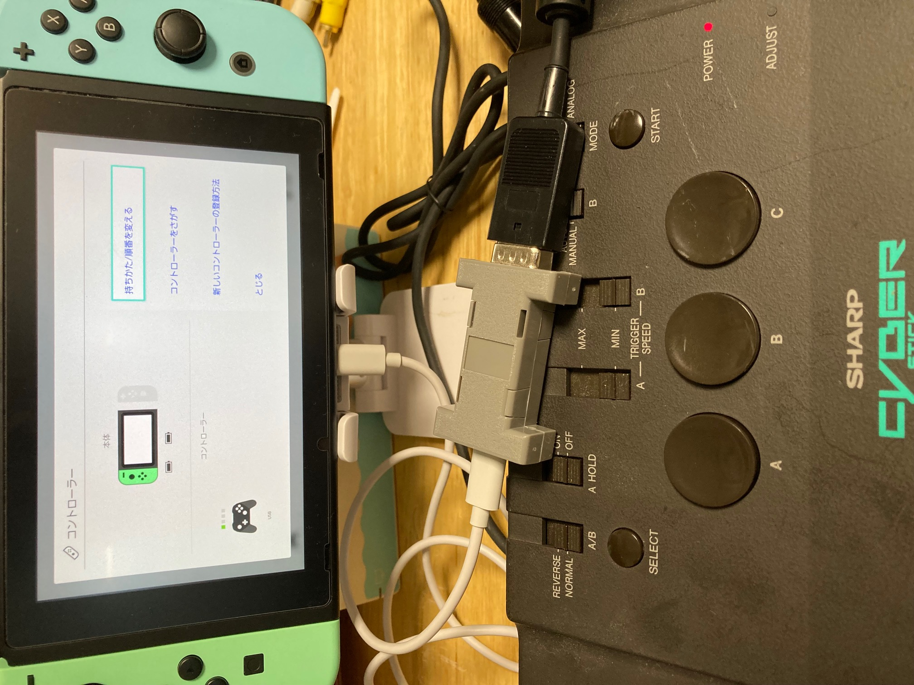  

動画については下記URLを参照してください。  
<https://twitter.com/v9938/status/1580212775111909376?s=20&t=MJM-NV-31tJaAHmfy5s3Zw>
<https://twitter.com/v9938/status/1579874855343730689?s=20&t=MJM-NV-31tJaAHmfy5s3Zw>

## ■ 頒布について   

本製品はBoothおよび家電のKENちゃん、BEEPさんにて近日販売予定です。  
(Boothの発送は、週末にまとめて発送になるため、お急ぎの方は他ショップを利用ください)

### BEEP  

URL未定  

### 家電のKENちゃん  

URL未定  

### Booth: (週１回の発送)  

<https://ifc.booth.pm/items/4229656>  
Boothでは先行品販売を実施しません [10/29以降 販売開始予定]  

## ■ 頒布品のメガドラミニ対応版とNintendo Switch対応版の違い

初期に書き込まれているファームウェアだけが異なります。ハードウェアに違いはありません。  
ユーザ側でファームウェアを書き換えることで、双方向の対応版を何回でも行き来できます。

## ■ 先行販売品について

先行販売版はXE1AJ-USBモードは仮実装になっています。  
メガドライブ2ミニ販売後に対応ファームウェアを公開する予定です。  

ユーザにて当該ファームウェアにアップデートをお願いします。  

## ■ 使用方法

1. D-SUB9Pin側に使いたいコントローラを接続します。
2. 先の細いものでコントローラモード切替スイッチを適切なモードにセットします。
3. USBコネクタにケーブルを接続して、使用する機器に接続します。  

MegaDrive2miniでCyberStickモードを使う場合はCONTROLLER2に接続してください。　　

**メガドライブコントローラとCyberStickでは、コントローラ側の電源端子が異なります。**  
**コントローラモード切替スイッチは、本機の電源が入っていない状態で切り替えてください。**

| メガドライブコントローラモード | Cyberstickモード(MSX仕様) |  
| - | - |
| 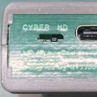  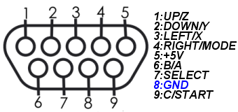 | 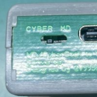  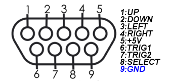|

## ■ ボタン配置について

各オリジナルコントローラのボタン配置に準拠しています。設定ソフトにてボタン配置は変更可能です。  
変更した配置は、コントローラのBボタンを押しながらケーブル抜差（電源投入）を行う事で初期値になります。

初期値でのWindows PC上での配置は下記の通りです。

### ●メガドライブ2ミニ向けファームウェア ボタン配置

#### メガドライブコントローラモード(SEGA ファイティングパッド6B互換モード)  

| メガドライブコントローラ | USBコントローラ配置 | 制限事項など |  
| - | - | - |
| スティック | Ｘ軸Ｙ軸 |  |
| Ａ、Ｂ、Ｃボタン | ボタン３、２、６|  |
| Ｘ、Ｙ、Ｚボタン | ボタン４、１、５ | 6ボタン対応コントローラーのみ有効 |
| ＭＯＤＥボタン | ボタン７ | 6ボタン対応コントローラーのみ有効 |
| スタートボタン | ボタン８ |  |

#### CyberStickモード(XE1AJ1-USB互換モード)  

| CyberStick | USBコントローラ配置 | 制限事項など |  
| - | - | - |
| スティック | Ｘ軸Ｙ軸 |  |
| スロットル前後 | Ｚ回転 |  |
| トリガボタンＡ、Ｂ、Ｃ | ボタン１、２、３ |  |
| トリガボタンＤ、Ｅ１、Ｅ２ | ボタン４、５、６ |  |
| トリガボタンＡ'、Ｂ' | ボタン１、２ |  |
| セレクト、スタートボタン | ボタン７、８ | CZ-8NJ2のデジタルモードでは使用できません。 |

#### CyberStickモード(SEGA ファイティングパッド6B互換モード　※Aボタンを押しながらUSBを接続)  

| CyberStick | USBコントローラ配置 | 制限事項など |  
| - | - | - |
| スティック | Ｘ軸Ｙ軸 |  |
| スロットル前後 | － |  |
| トリガボタンＡ、Ｂ、Ｃ | ボタン３、２、７ |  |
| トリガボタンＤ、Ｅ１、Ｅ２ | ボタン４、１、６ |  |
| トリガボタンＡ'、Ｂ' | ボタン３、２ |  |
| セレクト、スタートボタン | ボタン９、１０ | CZ-8NJ2のデジタルモードでは使用できません。 |

### ●Nintendo SWITCH向けファームウェア ボタン配置

#### メガドライブコントローラモード  

| メガドライブコントローラ | コントローラ配置 | 制限事項など |  
| - | - | - |
| スティック | 左アナログスティックＸＹ軸 |  |
| Ａ、Ｂ、Ｃボタン | ボタンＡ、Ｂ、Ｒ|  |
| Ｘ、Ｙ、Ｚボタン | ボタンＸ、Ｙ、Ｌ | 6ボタン対応コントローラーのみ有効 |
| ＭＯＤＥボタン | ボタンＨＯＭＥ | 6ボタン対応コントローラーのみ有効 |
| スタートボタン | ボタン［＋］ |  |

#### CyberStickモード  

| CyberStick | コントローラ配置 | 制限事項など |  
| - | - | - |
| スティック | 左アナログスティックＸＹ軸 |  |
| スロットル前後 | 右アナログスティックＹ軸 |  |
| トリガボタンＡ、Ｂ、Ｃ | ボタンＡ、Ｂ、Ｙ |  |
| トリガボタンＤ、Ｅ１、Ｅ２ | ボタンＸ、Ｒ、Ｌ |  |
| トリガボタンＡ'、Ｂ' | ボタンＡ、Ｂ |  |
| セレクト、スタートボタン | ボタンＨＯＭＥ、［＋］ | CZ-8NJ2のデジタルモードでは使用できません。 |

## ■ 変換遅延について

変換にかかる内部処理時間は、一番時間がかかるメガドライブ6ボタンパッドで使用時で8.5us程度です。  
いずれのモードでもLow Speed USB規格の最小通信単位である1frame(1ms)以内で完了していることを確認しています。  
そのため規格上は変換遅延が無いことになります。  

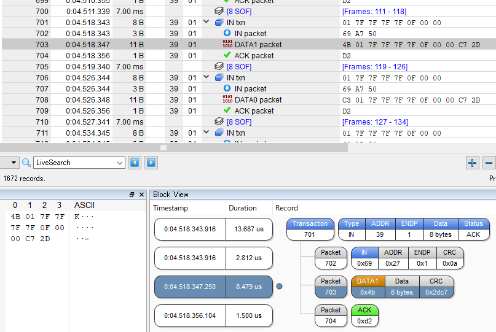

## ■ その他の注意点  

オリジナルのコントローラは製造後２０年以上経っています。  
動作不安定の場合は接続コントローラが正常に動作するかを確認をお願いします。

他の接続機器に影響がある場合があるのでコントローラはUSB接続前に接続してください。

コントローラモード切替スイッチ設定を誤ると回路保護のため一定時間電源が入らなくなる場合があります。  
その場合は、数分程度放置後再度接続する様にお願いします。  

## ■ ファームウェアアップデートについて(頒布版のみ対応)

本製品はファームウェアアップデートに対応しています。  
ファームウェアアップデートについては、Windows PCが必要になります。  

1. デバイスを一度取り外します。  
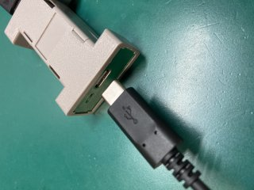  

2. Firmware Updateソフトを実行します。デバイスの接続待ち表示になります。  
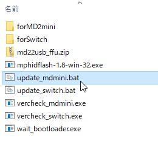  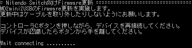  

3. 対応コントローラの［Cボタン］を押したままWindows PCに接続します。  
（コントローラモードスイッチは接続するコントローラに合わせてください。）  
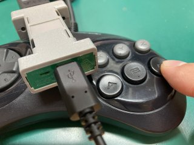

4. 正常に認識されると自動的にファームウェア更新が実行されます。  
認識されない場合は3からの手順を実施してください。　　
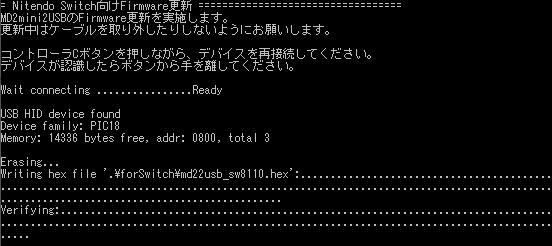  
5. ファームウェア更新完了表示が出たら、一度デバイスを取り外します。  
更新後、設定の状態によってボタンが正常に動作しない場合があります。  
その場合はBボタンを押しながらUSBケーブルを抜き差しを行いE2PROMを初期化してください。
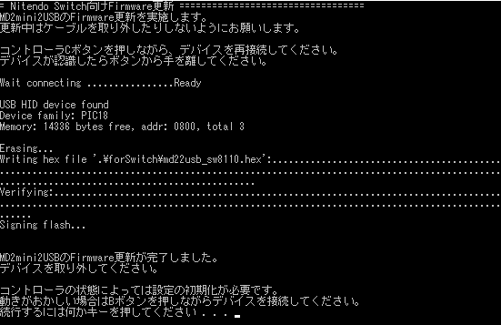  

  
### ファームウェア更新/書換ツール

下記URLにてファームウェア更新/書換に必要なツールとファイル一式を頒布しています。  
<https://github.com/v9938/md2mini2usb/raw/main/FFU/md22usb_ffu.zip>

ZIPファイルを解凍後に、下記バッチファイルを実行してください。  

`./FFU/update_mdmini.bat`　メガドライブ2ミニ向けファームウェア更新  
`./FFU/update_switch.bat`　Nintendo Switch向けファームウェア更新  

### ファームウェアVersion確認方法  

ファームウェアVersionについては上記Firmware Updateソフト解凍後に下記手順で確認可能です。

1. 接続しているコントローラを外します。
2. コントローラモード切替スイッチをCyber側にします。
3. Windows PCに接続します。
4. Version確認ソフトで確認します。  

`./FFU/vercheck_mdmini.exe`　メガドライブ2ミニ向け  
`./FFU/vercheck_switch.exe`　Nintendo Switch向け

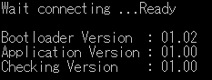  

謝辞：  
PID/UIDは、Microchipサブライセンスプログラムにより提供されたものを使用しています。  
ファームウェアアップデート機能には、 莎華(SAKA)さんのHID Bootloader (pic18Non-J)を利用しています。  
<http://www3.airnet.ne.jp/saka/hardware/pic-bootloader/pic-bootloader01.html>  

## ■ XE1AJ1-USB設定ソフトについて（予定）

**本機能についてマイコンソフトさんへの問い合わせは絶対行わない様にお願いします**  
マイコンソフトさんのXE1AJ1-USB設定ソフトにて、純正同様にセンターの遊び範囲、移動比率の設定などが可能です。
設定時は、コントローラモード切替スイッチをCyber側にし、Windows PCに接続してください。  

## ■ ボタン配置について

ボタン配置ソフトを実行することでボタン配置を変更することが可能です。  
現状NINTENDO SWITCH向けファームウェアのみ対応しています。

Switch用ファームウェア向け設定用ソフト
<https://github.com/v9938/md2mini2usb/raw/main/keyconfig/keyconfigSwitch.exe>  

メガドライブ2ミニ向けファームウェアについては、ソフト的にボタン配置を変更して保存する仕組みを有しています。  
XE1AJ-USB販売後に専用ソフトで変更できる様にする予定です。

## ■ GitHub公開データについて

ファームウェア：　　 <https://github.com/v9938/md2mini2usb/tree/main/firmware>  
回路図/基板データ：　<https://github.com/v9938/md2mini2usb/tree/main/PCB>

ファームウェアのコンパイルにはMicrochipのUSB library 'mla v2017_03_06'が必要です。  
頒布版とコードが異なりファームウェアアップデート機能が非対応になります。  

自作される場合は、秋月電子さんのマイコンボードを使うと良いと思います。  
<http://akizukidenshi.com/catalog/g/gK-05499/>  

## ■ 本機の仕様について

|仕様  | 詳細 |
| - | - |
| 使用マイコン | Microchip PIC18F14K50 |
| 定格 | 5V 50mA (ポリヒューズ250mA)|
| コントローラ規格 | USB2.0 HIDゲームコントローラ準拠(Direct Input方式) |
| キースキャン間隔 (SEGA ファイティングパッド6B互換モード) | 10ms(設定値)/8ms(実測値) |  
| キースキャン間隔 (XE1AJ-USB互換モード時) | 8ms(設定値)/8ms(実測値) |
| IN パケット応答時間 | メガドライブ6ボタンパッド使用時 8.5us(実測値) CyberStick使用時 8.4us(実測値) |
| 対応コントローラ | メガドライブ規格準拠コントローラ(8pin GND) MSX規格準拠コントローラ(9pin GND) |
| 動作確認環境 | Windows11/10/7 SEGA MegaDrive mini/Genesis mini SEGA MegaDrive2 mini/Genesis2 mini Nintendo SWITCH |
| 動作確認済みコントローラー | SEGA SJ-3500 SEGA SJ-6000 マイコンソフト XE-1ST2 マイコンソフト XE-1AP (PERSONAL COMPUTERモード) SHARP CZ-8NJ2 (CYBER STICK) FUJITSU FMT-PD102 |
